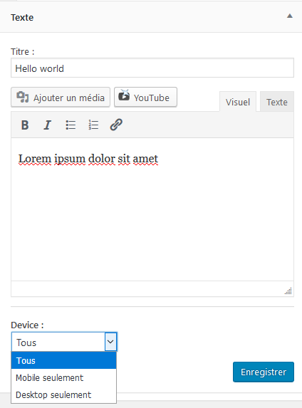

# Widgets Device Display Option
Wordpress plugin

## Description

Adds option for widgets to choose on which device they are displayed : mobile, desktop, or both.

The device detection is based on wp_is_mobile function.

## Screenshots

